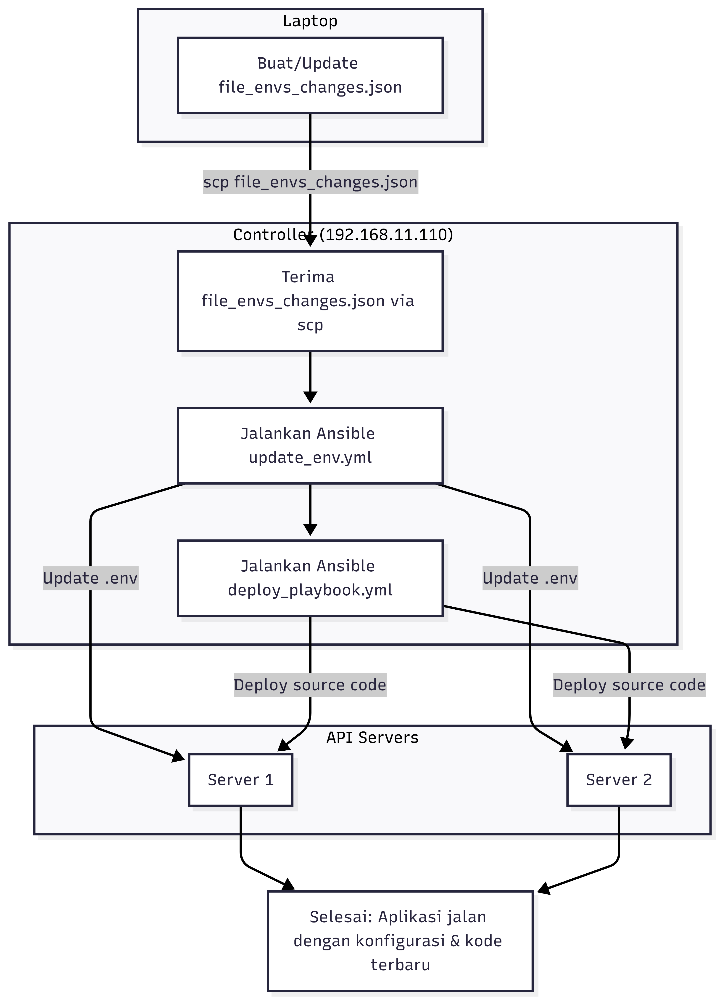
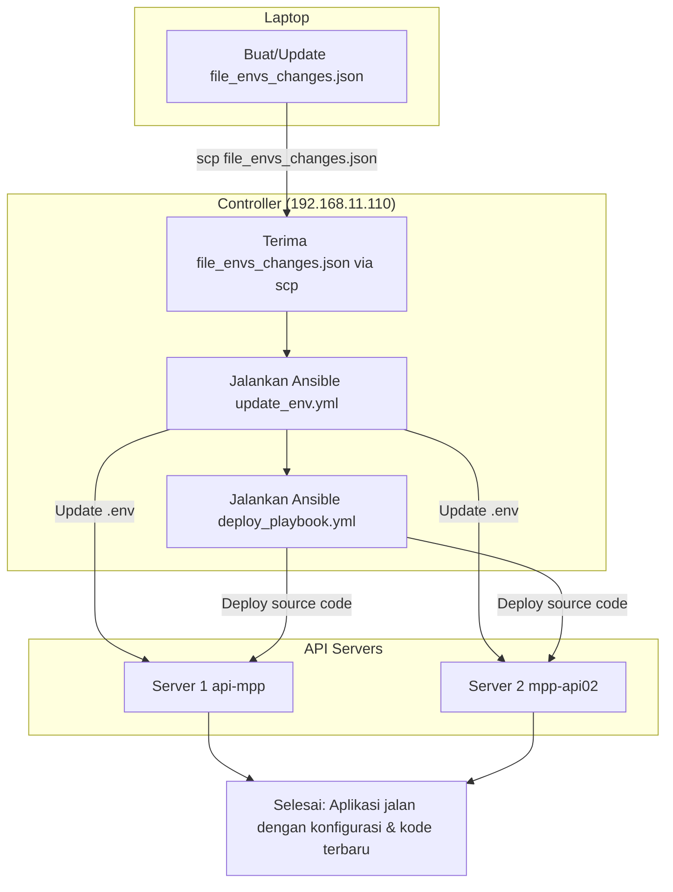

# Ansible Deployment Project

Proyek Ansible untuk deployment application (source code) dan update environment variables (`.env`) pada multiple servers via controller menggunakan SSH.

## Table of Contents

1. [Quick Start](#quick-start)
2. [Project Structure](#project-structure)
3. [Prerequisites](#prerequisites)
4. [Inventory & Servers](#inventory--servers)
5. [Workflow Overview](#workflow-overview)
6. [Three Deployment Scenarios](#three-deployment-scenarios)
7. [CLI Commands](#cli-commands)
8. [File Formats](#file-formats)
9. [Playbooks](#playbooks)
10. [Scripts](#scripts)
11. [Backup & Rollback](#backup--rollback)
12. [Troubleshooting](#troubleshooting)
13. [Best Practices](#best-practices)

---

## Quick Start

### Scenario 1: Update Source Code Only
```bash
ssh ubuntu@192.168.11.110 "export LC_ALL=C.UTF-8 LANG=C.UTF-8 && cd /home/ubuntu/ansible && ansible-playbook -i hosts.ini deploy_playbook.yml"
```

### Scenario 2: Update .env Only
```bash
scp file_envs_changes.json ubuntu@192.168.11.110:/home/ubuntu/ansible/
ssh ubuntu@192.168.11.110 "cd /home/ubuntu/ansible && ansible-playbook -i hosts.ini update_env.yml -e @file_envs_changes.json --limit api_servers"
```

### Scenario 3: Update .env + Deploy Source Code (Recommended)
```bash
./full_deploy.sh -m full
```

---

## Project Structure

```
/home/ubuntu/ansible/
├── hosts.ini                    # Inventory file (define servers)
├── deploy_playbook.yml          # Playbook to deploy source code
├── update_env.yml               # Playbook to update .env
├── full_deploy.sh               # Unified deployment script
├── deploy_env.sh                # Script to deploy .env updates
├── update_env.sh                # CLI script for direct SSH update
├── pusher_vars.json             # Example vars file (Pusher config)
├── file_envs_changes.json       # Template for .env changes
├── README.md                    # This file
├── DEPLOYMENT_WORKFLOW.md       # Detailed workflow documentation
├── README_ENV.md                # Environment update guide
└── README_ENV_UPDATED.md        # Extended environment guide
```

---

## Prerequisites

### On Your Laptop
- SSH client (built-in on Linux/Mac, use WSL or PuTTY on Windows).
- Ability to create/edit JSON or YAML files.
- SSH key pair configured for controller access.

### On Controller (192.168.11.110)
- Ansible installed (`ansible-playbook` available).
- SSH connectivity to both target servers.
- Read access to `hosts.ini`, `deploy_playbook.yml`, `update_env.yml`.

### On Target Servers (api-mpp, mpp-api02)
- Ubuntu user with SSH access.
- Application directory: `/home/ubuntu/mpp-new/mpp-mobile-backend_1/`
- `.env` file exists in application directory.
- `deploy.sh` script exists in application directory.

### SSH Key Setup (One-Time)
```bash
# Generate SSH key (if not exist)
ssh-keygen -t rsa -N "" -f ~/.ssh/id_rsa

# Copy key to controller (one-time)
ssh-copy-id ubuntu@192.168.11.110
```

---

## Inventory & Servers

File: `hosts.ini`

```ini
[api_servers]
api-mpp ansible_host=192.168.11.120 
mpp-api02 ansible_host=192.168.11.141

[api_servers:vars]
ansible_user=ubuntu
ansible_python_interpreter=/usr/bin/python3
```

**Servers:**
- `api-mpp` (192.168.11.120) - Server 1
- `mpp-api02` (192.168.11.141) - Server 2

Both servers are in group `api_servers` for easy targeting with `--limit`.

---

## Workflow Overview



```
Laptop
  ├─ Buat/Update file_envs_changes.json (or pusher_vars.json)
  │
  └─> SSH ke Controller (192.168.11.110)
       │
       ├─ Jalankan update_env.yml (update .env di server) [Optional]
       ├─ Jalankan deploy_playbook.yml (deploy source code) [Optional]
       │
       └─> Ansible terhubung ke kedua server
            ├─ api-mpp (192.168.11.120)
            └─ mpp-api02 (192.168.11.141)
                ├─ Backup .env (jika ada update .env)
                ├─ Update .env dengan vars dari JSON
                ├─ Pull source code / deploy (jika ada update source)
                └─ Done
```

---

## Three Deployment Scenarios

### Scenario 1: Update Source Code Only

**When**: Hanya ada perubahan source code, `.env` tidak berubah.

**Command**:
```bash
ssh ubuntu@192.168.11.110 "export LC_ALL=C.UTF-8 LANG=C.UTF-8 && cd /home/ubuntu/ansible && ansible-playbook -i hosts.ini deploy_playbook.yml --limit api_servers"
```

**Or using script**:
```bash
./full_deploy.sh -m source
```

**What happens**:
1. Playbook `deploy_playbook.yml` runs on controller.
2. Controller SSH to both servers.
3. On each server, execute `/home/ubuntu/mpp-new/mpp-mobile-backend_1/deploy.sh`.
4. Script will pull source code (git pull or custom logic).

---

### Scenario 2: Update .env Only

**When**: Hanya ada perubahan variabel `.env` (mis. Pusher config), source code tidak berubah.

**Files to prepare on laptop**:
- `file_envs_changes.json` atau `pusher_vars.json` (berisi config Pusher terbaru)

**Command** (step-by-step):
```bash
# Step 1: Send file to controller
scp file_envs_changes.json ubuntu@192.168.11.110:/home/ubuntu/ansible/

# Step 2: Update .env on servers
ssh ubuntu@192.168.11.110 "cd /home/ubuntu/ansible && ansible-playbook -i hosts.ini update_env.yml -e @file_envs_changes.json --limit api_servers"
```

**Or using script**:
```bash
./full_deploy.sh -m env -v file_envs_changes.json
```

**What happens**:
1. File dikirim ke controller.
2. Playbook `update_env.yml` berjalan.
3. Controller SSH ke kedua server.
4. Di tiap server:
   - Stat `.env` (check if exists).
   - Backup `.env` → `.env.bak_<epoch>` (jika exist).
   - Update/append setiap `KEY=VALUE` dari JSON (idempotent).
   - Display verification (show updated lines).

**Important**: Isi file `.env` lama tetap utuh, hanya KEY yang ada di JSON yang di-update/ditambah.

---

### Scenario 3: Update .env + Deploy Source Code (Recommended)

**When**: Ada perubahan baik `.env` maupun source code (kasus paling umum di produksi).

**Files to prepare on laptop**:
- `file_envs_changes.json` atau `pusher_vars.json`

**Command** (step-by-step):
```bash
# Step 1: Send file to controller
scp file_envs_changes.json ubuntu@192.168.11.110:/home/ubuntu/ansible/

# Step 2: Update .env + deploy source
ssh ubuntu@192.168.11.110 "export LC_ALL=C.UTF-8 LANG=C.UTF-8 && cd /home/ubuntu/ansible && ansible-playbook -i hosts.ini update_env.yml -e @file_envs_changes.json --limit api_servers && ansible-playbook -i hosts.ini deploy_playbook.yml --limit api_servers"
```

**Or using script (RECOMMENDED)**:
```bash
./full_deploy.sh -m full
```

**What happens**:
1. File dikirim ke controller.
2. **STEP 1**: Update `.env` di kedua server (dengan backup).
3. **STEP 2**: Deploy source code di kedua server.
4. Aplikasi jalan dengan konfigurasi & kode terbaru.

---

## CLI Commands

### Using `full_deploy.sh` (Recommended)

Script unified untuk semua skenario.

**Basic usage**:
```bash
# Scenario 1: Source code only
./full_deploy.sh -m source

# Scenario 2: .env only
./full_deploy.sh -m env

# Scenario 3: .env + source code (default)
./full_deploy.sh -m full
```

**Advanced options**:
```bash
# Target specific server
./full_deploy.sh -m full -l mpp-api02

# Use custom vars file
./full_deploy.sh -m env -v my_vars.json

# Custom controller
./full_deploy.sh -m full -c ubuntu@192.168.1.100

# Combine options
./full_deploy.sh -m full -l mpp-api02 -v custom_vars.json
```

### Using `deploy_env.sh`

Script untuk update `.env` saja.

```bash
# Update dengan default pusher_vars.json
./deploy_env.sh

# Target specific server
./deploy_env.sh -l mpp-api02

# Custom vars file
./deploy_env.sh -v file_envs_changes.json

# Custom controller
./deploy_env.sh -c ubuntu@192.168.1.100
```

### Using `update_env.sh` (Direct SSH)

CLI script untuk SSH langsung ke server (tanpa Ansible).

```bash
# Update dua variable di server kedua
./update_env.sh -H 192.168.11.141 -p /home/ubuntu/mpp-new/mpp-mobile-backend_1/.env FOO=bar BAZ=qux

# Gunakan hostname
./update_env.sh -H mpp-api02 -p /home/ubuntu/mpp-new/mpp-mobile-backend_1/.env SECRET=topsecret
```

---

## File Formats

### JSON Format for Environment Variables

File: `file_envs_changes.json` atau `pusher_vars.json`

```json
{
  "env_path": "/home/ubuntu/mpp-new/mpp-mobile-backend_1/.env",
  "env_vars": {
    "PUSHER_APP_ID": "your_id",
    "PUSHER_APP_KEY": "your_key",
    "PUSHER_APP_SECRET": "your_secret",
    "PUSHER_HOST": "your_host",
    "PUSHER_PORT": "443",
    "PUSHER_SCHEME": "https",
    "PUSHER_APP_CLUSTER": "mt1",
    "OTHER_VAR": "value"
  }
}
```

### YAML Format for Environment Variables

File: `pusher_vars.yml` atau `file_envs_changes.yml`

```yaml
env_path: /home/ubuntu/mpp-new/mpp-mobile-backend_1/.env
env_vars:
  PUSHER_APP_ID: "your_id"
  PUSHER_APP_KEY: "your_key"
  PUSHER_APP_SECRET: "your_secret"
  PUSHER_HOST: "your_host"
  PUSHER_PORT: "443"
  PUSHER_SCHEME: "https"
  PUSHER_APP_CLUSTER: "mt1"
  OTHER_VAR: "value"
```

**Note**: Ansible support kedua format (JSON dan YAML) dengan `-e @filename`.

---

## Playbooks

### `update_env.yml` - Update Environment File

**Purpose**: Update atau append baris `KEY=VALUE` ke file `.env` di server.

**Features**:
- Idempotent (aman dijalankan berkali-kali).
- Backup `.env` sebelum update → `.env.bak_<epoch>`.
- Hanya update KEY yang ada di `env_vars`, baris lain tetap utuh.
- Display verifikasi hasil di output playbook.

**Usage**:
```bash
ansible-playbook -i hosts.ini update_env.yml -e @file_envs_changes.json --limit api_servers
```

**What it does**:
1. Check apakah `.env` ada (`stat` task).
2. Backup `.env` jika exist.
3. Create `.env` jika belum exist.
4. Untuk setiap `KEY: VALUE` di `env_vars`:
   - Jika `KEY=` sudah ada di `.env` → replace value (idempotent).
   - Jika belum ada → append baris baru `KEY=VALUE`.
5. Grep dan display baris-baris yang di-update.

---

### `deploy_playbook.yml` - Deploy Source Code

**Purpose**: Deploy/update source code di server.

**Features**:
- Runs `deploy.sh` script pada application directory.
- Idempotent execution.
- Display hasil deployment di output playbook.

**Usage**:
```bash
ansible-playbook -i hosts.ini deploy_playbook.yml --limit api_servers
```

**Assumes**:
- Script `deploy.sh` sudah exist di `/home/ubuntu/mpp-new/mpp-mobile-backend_1/`.
- Script handle git pull, build, atau custom deployment logic.

---

## Scripts

### `full_deploy.sh` - Unified Deployment Script

**Purpose**: Simplify semua 3 skenario deployment dengan satu skrip.

**Modes**:
- `source` — Deploy source code only.
- `env` — Update .env only.
- `full` — Update .env + deploy source code.

**Usage**:
```bash
./full_deploy.sh -m full
./full_deploy.sh -m env -l mpp-api02
./full_deploy.sh -m source
```

**Advance**:
- Auto `scp` vars file ke controller.
- Handle parameter passing ke playbooks.
- Clear output dengan step-by-step execution.

---

### `deploy_env.sh` - .env Deployment Script

**Purpose**: Streamline `.env` update workflow dengan auto `scp` + playbook execution.

**Usage**:
```bash
./deploy_env.sh                      # default: pusher_vars.json
./deploy_env.sh -v file_envs_changes.json
./deploy_env.sh -l mpp-api02 -v my_vars.json
```

---

### `update_env.sh` - Direct SSH Update Script

**Purpose**: Update `.env` di server via direct SSH (tanpa Ansible).

**Usage**:
```bash
./update_env.sh -H 192.168.11.141 -p /path/.env KEY1=value1 KEY2=value2
./update_env.sh -H mpp-api02 -p /path/.env SECRET=topsecret
```

**Note**: Cocok untuk quick adhoc updates, tapi kurang ideal untuk produksi (tanpa backup auto).

---

## Backup & Rollback

### Automatic Backup

Setiap kali `update_env.yml` berjalan, playbook otomatis:
- Create backup: `.env` → `.env.bak_<epoch>` (remote di server).
- Epoch = Unix timestamp saat backup dibuat.

**Example**:
```
/home/ubuntu/mpp-new/mpp-mobile-backend_1/.env.bak_1702803600
/home/ubuntu/mpp-new/mpp-mobile-backend_1/.env.bak_1702807200
```

### Manual Rollback

Jika ada masalah, restore dari backup:

```bash
ssh ubuntu@<server> "cp /home/ubuntu/mpp-new/mpp-mobile-backend_1/.env.bak_<epoch> /home/ubuntu/mpp-new/mpp-mobile-backend_1/.env"
```

**Example**:
```bash
ssh ubuntu@192.168.11.141 "cp /home/ubuntu/mpp-new/mpp-mobile-backend_1/.env.bak_1702803600 /home/ubuntu/mpp-new/mpp-mobile-backend_1/.env"
```

### Verify Backup Exists

```bash
ssh ubuntu@<server> "ls -la /home/ubuntu/mpp-new/mpp-mobile-backend_1/.env*"
```

---

## Troubleshooting

### Q: "Permission denied" saat SSH atau SCP

**A**: SSH key belum setup atau controller tidak dapat diakses.

**Solution**:
```bash
# Setup SSH key (one-time)
ssh-keygen -t rsa -N "" -f ~/.ssh/id_rsa
ssh-copy-id ubuntu@192.168.11.110

# Test SSH
ssh ubuntu@192.168.11.110 "echo 'SSH OK'"
```

### Q: Playbook error "No module named ansible"

**A**: Ansible belum installed di controller.

**Solution** (di controller):
```bash
sudo apt-get update
sudo apt-get install ansible
```

### Q: File .env tidak ada di server

**A**: Path salah atau file belum dibuat.

**Solution**:
1. Verify path di `file_envs_changes.json`.
2. Manual create `.env` di server:
   ```bash
   ssh ubuntu@<server> "touch /home/ubuntu/mpp-new/mpp-mobile-backend_1/.env"
   ```

### Q: Update .env berhasil tapi deploy gagal

**A**: Likely `deploy.sh` script ada error.

**Solution**:
1. SSH ke server dan test `deploy.sh` manual:
   ```bash
   ssh ubuntu@<server> "cd /home/ubuntu/mpp-new/mpp-mobile-backend_1 && ./deploy.sh"
   ```
2. Check log dari deploy.sh output.
3. Fix issue di server atau di `deploy.sh` script.

### Q: Mau update hanya satu server saja

**A**: Gunakan `--limit` dengan hostname.

**Example**:
```bash
./full_deploy.sh -m full -l mpp-api02
```

### Q: Bagaimana jika file vars sudah ada di controller, mau overwrite?

**A**: `scp` otomatis overwrite file dengan nama sama.

```bash
scp file_envs_changes.json ubuntu@192.168.11.110:/home/ubuntu/ansible/
```

**Hasil**: File lama di controller akan diganti dengan file baru dari laptop.

### Q: Isi file .env lama hilang setelah update?

**A**: Tidak. Playbook hanya update/append KEY yang ada di JSON, baris lain tetap utuh.

**Example**:
- Existing `.env`: `APP_NAME=MyApp`, `APP_ENV=production`, `OLD_KEY=oldvalue`
- JSON vars: `{"PUSHER_APP_ID": "newid", "NEW_KEY": "newval"}`
- Result `.env`: `APP_NAME=MyApp`, `APP_ENV=production`, `OLD_KEY=oldvalue`, `PUSHER_APP_ID=newid`, `NEW_KEY=newval`

---

## Best Practices

### 1. Use Version Control for Vars Files

Simpan file vars di repository (private) untuk audit trail dan rollback.

```bash
git add pusher_vars.json
git commit -m "Update Pusher config"
git push
```

### 2. Test on One Server First

Sebelum update semua server, test di satu server dulu:

```bash
./full_deploy.sh -m env -l mpp-api02 -v file_envs_changes.json
```

### 3. Review Playbook Output

Selalu baca output playbook, khususnya bagian "verification" untuk ensure perubahan sesuai harapan.

### 4. Backup Critical Configs

Jangan hanya percaya automatic backup, also backup manual:

```bash
ssh ubuntu@<server> "cp /home/ubuntu/mpp-new/mpp-mobile-backend_1/.env /home/ubuntu/mpp-new/mpp-mobile-backend_1/.env.manual_backup_$(date +%Y%m%d_%H%M%S)"
```

### 5. Document Changes

Setiap kali update, catat di changelog atau commit message:

```
Update Pusher config:
- PUSHER_APP_ID: xxx
- PUSHER_HOST: xxx
- etc

Deployed on: 2024-12-17
Target: api_servers
```

### 6. Use Descriptive Filenames

Gunakan nama file yang jelas:
- `pusher_vars.json` — untuk Pusher config
- `database_vars.json` — untuk database config
- `api_config_prod.json` — untuk production API config

---

## Checklist Before Deployment

- [ ] File vars (JSON/YAML) sudah ada di laptop dengan nilai terbaru.
- [ ] SSH ke controller (192.168.11.110) bisa tanpa password.
- [ ] SSH dari controller ke target servers bisa tanpa password.
- [ ] File `.env` sudah exist di tiap server.
- [ ] Script `deploy.sh` sudah exist dan executable di server.
- [ ] Ansible installed di controller (`ansible-playbook` command available).
- [ ] Sudah review playbook output sebelum eksekusi ulang.
- [ ] Sudah punya rollback plan jika update gagal.

---

## File Reference

| File | Purpose |
|------|---------|
| `hosts.ini` | Inventory (define servers & groups) |
| `deploy_playbook.yml` | Playbook untuk deploy source code |
| `update_env.yml` | Playbook untuk update .env |
| `full_deploy.sh` | Unified deployment script (recommended) |
| `deploy_env.sh` | Script untuk .env deployment |
| `update_env.sh` | CLI untuk direct SSH update |
| `pusher_vars.json` | Example vars file untuk Pusher config |
| `file_envs_changes.json` | Template untuk .env changes |
| `README.md` | This file |
| `DEPLOYMENT_WORKFLOW.md` | Detailed workflow (legacy) |
| `README_ENV.md` | Environment update guide (legacy) |

---

## Diagram



---

## Support & Questions

Untuk pertanyaan atau issues, refer to documentation files:
- `DEPLOYMENT_WORKFLOW.md` — Detailed workflow & scenarios
- `README_ENV.md` — Environment variables guide
- Playbook files untuk technical details

---

**Last Updated**: 2024-12-17
